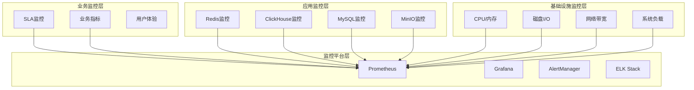

# 四层存储架构运维监控和告警体系

## 1. 监控体系概览

### 1.1 监控层次架构


### 1.2 技术栈选型
```yaml
monitoring_stack:
  metrics_collection: "Prometheus"
  visualization: "Grafana" 
  alerting: "AlertManager"
  log_collection: "ELK Stack (Elasticsearch + Logstash + Kibana)"
  tracing: "Jaeger"
  automation: "Ansible + Terraform"
  notification: "PagerDuty + Slack + 企业微信"
```

## 2. 各层存储监控指标

### 2.1 HOT层 (Redis) 监控指标

#### 2.1.1 核心性能指标
```yaml
redis_metrics:
  availability:
    - redis_up: "Redis实例可用性"
    - redis_master_link_up: "主从连接状态"
    - redis_sentinel_masters: "Sentinel管理的主节点数"
    
  performance:
    - redis_commands_processed_per_sec: "每秒处理命令数"
    - redis_instantaneous_ops_per_sec: "瞬时QPS"
    - redis_connected_clients: "连接客户端数"
    - redis_blocked_clients: "阻塞客户端数"
    
  memory:
    - redis_memory_used_bytes: "已使用内存"
    - redis_memory_max_bytes: "最大内存限制"
    - redis_memory_fragmentation_ratio: "内存碎片率"
    
  replication:
    - redis_master_repl_offset: "主节点复制偏移量"
    - redis_slave_repl_offset: "从节点复制偏移量" 
    - redis_slave_lag: "主从同步延迟"
    
  persistence:
    - redis_rdb_last_save_timestamp: "最后RDB保存时间"
    - redis_aof_last_rewrite_duration_sec: "AOF重写耗时"
```

#### 2.1.2 告警规则
```yaml
redis_alerts:
  - alert: RedisDown
    expr: redis_up == 0
    for: 1m
    severity: P0
    summary: "Redis实例宕机"
    
  - alert: RedisHighMemoryUsage
    expr: (redis_memory_used_bytes / redis_memory_max_bytes) > 0.8
    for: 5m
    severity: P1
    summary: "Redis内存使用率超过80%"
    
  - alert: RedisHighLatency
    expr: redis_command_duration_seconds_p99 > 0.01
    for: 3m
    severity: P1
    summary: "Redis命令P99延迟超过10ms"
    
  - alert: RedisMasterSlaveSync
    expr: redis_slave_lag > 60
    for: 2m
    severity: P1
    summary: "Redis主从同步延迟超过60秒"
```

### 2.2 WARM层 (ClickHouse) 监控指标

#### 2.2.1 核心性能指标
```yaml
clickhouse_metrics:
  availability:
    - clickhouse_up: "ClickHouse实例可用性"
    - clickhouse_replica_is_active: "副本活跃状态"
    - clickhouse_zookeeper_session_uptime: "ZooKeeper连接时长"
    
  performance:
    - clickhouse_query_total: "查询总数"
    - clickhouse_query_duration_seconds: "查询延迟分布"
    - clickhouse_insert_total: "插入总数"
    - clickhouse_concurrent_queries: "并发查询数"
    
  storage:
    - clickhouse_disk_space_used: "磁盘空间使用"
    - clickhouse_parts_count: "数据分片数量"
    - clickhouse_rows_count: "总行数"
    - clickhouse_compression_ratio: "数据压缩比"
    
  memory:
    - clickhouse_memory_usage: "内存使用量"
    - clickhouse_max_memory_usage: "最大内存使用"
    - clickhouse_memory_tracking: "内存追踪信息"
```

#### 2.2.2 告警规则
```yaml
clickhouse_alerts:
  - alert: ClickHouseDown
    expr: clickhouse_up == 0
    for: 1m
    severity: P0
    summary: "ClickHouse实例宕机"
    
  - alert: ClickHouseHighQueryLatency
    expr: histogram_quantile(0.95, rate(clickhouse_query_duration_seconds_bucket[5m])) > 0.1
    for: 5m
    severity: P1
    summary: "ClickHouse查询P95延迟超过100ms"
    
  - alert: ClickHouseHighDiskUsage
    expr: (clickhouse_disk_space_used / clickhouse_disk_space_total) > 0.8
    for: 5m
    severity: P1
    summary: "ClickHouse磁盘使用率超过80%"
    
  - alert: ClickHouseReplicationLag
    expr: clickhouse_replica_delay > 300
    for: 3m
    severity: P1
    summary: "ClickHouse副本同步延迟超过5分钟"
```

### 2.3 COOL层 (MySQL) 监控指标

#### 2.3.1 核心性能指标
```yaml
mysql_metrics:
  availability:
    - mysql_up: "MySQL实例可用性"
    - mysql_slave_io_running: "从库IO线程状态"
    - mysql_slave_sql_running: "从库SQL线程状态"
    
  performance:
    - mysql_global_status_queries: "查询总数"
    - mysql_global_status_slow_queries: "慢查询数"
    - mysql_global_status_connections: "连接总数"
    - mysql_global_status_threads_connected: "当前连接数"
    - mysql_global_status_threads_running: "运行线程数"
    
  innodb:
    - mysql_global_status_innodb_buffer_pool_hit_rate: "InnoDB缓冲池命中率"
    - mysql_global_status_innodb_log_waits: "InnoDB日志等待数"
    - mysql_global_status_innodb_lock_time_avg: "InnoDB平均锁时间"
    
  replication:
    - mysql_slave_lag_seconds: "主从复制延迟"
    - mysql_slave_sql_delay: "SQL线程延迟"
    - mysql_binlog_size_bytes: "Binlog文件大小"
```

#### 2.3.2 告警规则
```yaml
mysql_alerts:
  - alert: MySQLDown
    expr: mysql_up == 0
    for: 1m
    severity: P0
    summary: "MySQL实例宕机"
    
  - alert: MySQLReplicationStopped
    expr: mysql_slave_io_running == 0 or mysql_slave_sql_running == 0
    for: 1m
    severity: P0
    summary: "MySQL主从复制停止"
    
  - alert: MySQLHighConnections
    expr: mysql_global_status_threads_connected / mysql_global_variables_max_connections > 0.8
    for: 5m
    severity: P1
    summary: "MySQL连接数超过80%"
    
  - alert: MySQLSlowQueries
    expr: rate(mysql_global_status_slow_queries[5m]) > 10
    for: 5m
    severity: P1
    summary: "MySQL慢查询频率过高"
    
  - alert: MySQLReplicationLag
    expr: mysql_slave_lag_seconds > 300
    for: 3m
    severity: P1
    summary: "MySQL主从延迟超过5分钟"
```

### 2.4 COLD层 (MinIO) 监控指标

#### 2.4.1 核心性能指标
```yaml
minio_metrics:
  availability:
    - minio_cluster_nodes_online: "在线节点数"
    - minio_cluster_nodes_offline: "离线节点数"
    - minio_heal_objects_error_total: "修复失败对象数"
    
  storage:
    - minio_cluster_capacity_usable_total: "集群可用容量"
    - minio_cluster_capacity_used_total: "集群已用容量"
    - minio_bucket_objects_count: "桶对象数量"
    - minio_bucket_size_bytes: "桶大小"
    
  performance:
    - minio_http_requests_total: "HTTP请求总数"
    - minio_http_request_duration_seconds: "HTTP请求延迟"
    - minio_s3_requests_total: "S3 API请求总数"
    - minio_s3_errors_total: "S3 API错误总数"
    
  disk:
    - minio_disk_storage_used: "磁盘存储使用量"
    - minio_disk_storage_total: "磁盘总容量"
    - minio_disk_storage_free: "磁盘剩余容量"
```

#### 2.4.2 告警规则
```yaml
minio_alerts:
  - alert: MinIONodesOffline
    expr: minio_cluster_nodes_offline > 0
    for: 2m
    severity: P1
    summary: "MinIO集群有节点离线"
    
  - alert: MinIOHighStorageUsage
    expr: (minio_cluster_capacity_used_total / minio_cluster_capacity_usable_total) > 0.8
    for: 5m
    severity: P1
    summary: "MinIO存储使用率超过80%"
    
  - alert: MinIOHighErrorRate
    expr: rate(minio_s3_errors_total[5m]) / rate(minio_s3_requests_total[5m]) > 0.05
    for: 5m
    severity: P1
    summary: "MinIO S3 API错误率超过5%"
    
  - alert: MinIOHighLatency
    expr: histogram_quantile(0.95, rate(minio_http_request_duration_seconds_bucket[5m])) > 2
    for: 5m
    severity: P1
    summary: "MinIO HTTP请求P95延迟超过2秒"
```

## 3. SLI/SLO 监控体系

### 3.1 服务水平指标定义
```yaml
service_level_indicators:
  availability_sli:
    hot_layer:
      metric: "avg_over_time(redis_up[1h])"
      target: "> 0.9995"  # 99.95%
      
    warm_layer:
      metric: "avg_over_time(clickhouse_up[1h])"
      target: "> 0.999"   # 99.9%
      
    cool_layer:
      metric: "avg_over_time(mysql_up[1h])"
      target: "> 0.999"   # 99.9%
      
    cold_layer:
      metric: "avg_over_time(minio_nodes_online_ratio[1h])"
      target: "> 0.995"   # 99.5%
  
  latency_sli:
    hot_layer:
      metric: "histogram_quantile(0.99, redis_command_duration_seconds)"
      target: "< 0.01"    # P99 < 10ms
      
    warm_layer:
      metric: "histogram_quantile(0.95, clickhouse_query_duration_seconds)"
      target: "< 0.1"     # P95 < 100ms
      
    cool_layer:
      metric: "histogram_quantile(0.95, mysql_query_duration_seconds)"
      target: "< 0.5"     # P95 < 500ms
      
    cold_layer:
      metric: "histogram_quantile(0.95, minio_request_duration_seconds)"
      target: "< 2.0"     # P95 < 2s
      
  throughput_sli:
    hot_layer:
      metric: "rate(redis_commands_total[5m])"
      target: "> 50000"   # > 50K QPS
      
    warm_layer:
      metric: "rate(clickhouse_queries_total[5m])"
      target: "> 3000"    # > 3K QPS
      
    cool_layer:
      metric: "rate(mysql_queries_total[5m])"
      target: "> 800"     # > 800 QPS
      
  error_rate_sli:
    overall:
      metric: "rate(http_requests_total{status=~'5..'}[5m]) / rate(http_requests_total[5m])"
      target: "< 0.001"   # < 0.1%
```

### 3.2 SLO 告警规则
```yaml
slo_alerts:
  - alert: SLOAvailabilityBreach
    expr: |
      (
        (1 - avg_over_time(redis_up[1h])) > 0.0005 or
        (1 - avg_over_time(clickhouse_up[1h])) > 0.001 or
        (1 - avg_over_time(mysql_up[1h])) > 0.001 or
        (1 - avg_over_time(minio_up[1h])) > 0.005
      )
    for: 0m
    severity: P0
    summary: "SLO可用性目标违反"
    
  - alert: SLOLatencyBreach
    expr: |
      (
        histogram_quantile(0.99, redis_command_duration_seconds) > 0.01 or
        histogram_quantile(0.95, clickhouse_query_duration_seconds) > 0.1 or
        histogram_quantile(0.95, mysql_query_duration_seconds) > 0.5 or
        histogram_quantile(0.95, minio_request_duration_seconds) > 2.0
      )
    for: 5m
    severity: P1
    summary: "SLO延迟目标违反"
    
  - alert: SLOThroughputBreach
    expr: |
      (
        rate(redis_commands_total[5m]) < 50000 or
        rate(clickhouse_queries_total[5m]) < 3000 or
        rate(mysql_queries_total[5m]) < 800
      )
    for: 5m
    severity: P1
    summary: "SLO吞吐量目标违反"
```

## 4. 告警策略和通知

### 4.1 告警分级策略
```yaml
alert_levels:
  P0_critical:
    description: "服务完全不可用，数据丢失风险"
    response_time: "5分钟内"
    notification_channels:
      - "电话"
      - "短信" 
      - "邮件"
      - "PagerDuty"
      - "企业微信群"
    examples:
      - "Redis/MySQL/ClickHouse完全宕机"
      - "数据损坏或丢失"
      - "安全漏洞"
      
  P1_high:
    description: "性能严重下降，部分功能受影响"
    response_time: "15分钟内"
    notification_channels:
      - "企业微信"
      - "邮件"
      - "Slack"
    examples:
      - "延迟超过SLO目标"
      - "存储使用率>80%"
      - "部分节点故障"
      
  P2_medium:
    description: "潜在问题，需要关注"
    response_time: "1小时内"
    notification_channels:
      - "邮件"
      - "监控仪表板"
    examples:
      - "资源使用率较高"
      - "慢查询增多"
      - "连接数接近上限"
      
  P3_low:
    description: "信息性告警"
    response_time: "工作时间内"
    notification_channels:
      - "邮件"
    examples:
      - "容量预警"
      - "配置变更通知"
```

### 4.2 告警抑制和去重
```yaml
alert_routing:
  inhibit_rules:
    # 如果整个集群宕机，抑制单个节点告警
    - source_match:
        alertname: 'ClusterDown'
      target_match:
        alertname: 'NodeDown'
      equal: ['cluster']
      
    # 如果主库宕机，抑制从库相关告警
    - source_match:
        alertname: 'MySQLMasterDown'
      target_match_re:
        alertname: 'MySQL.*Slave.*'
      equal: ['cluster']
      
  group_by: ['alertname', 'cluster', 'instance']
  group_wait: 30s
  group_interval: 5m
  repeat_interval: 12h
  
  routes:
    - match:
        severity: P0
      receiver: 'critical-alerts'
      group_wait: 10s
      repeat_interval: 5m
      
    - match:
        severity: P1
      receiver: 'high-alerts'
      group_wait: 30s
      repeat_interval: 1h
      
    - match:
        severity: P2
      receiver: 'medium-alerts'
      group_wait: 5m
      repeat_interval: 6h
```

### 4.3 告警通知配置
```yaml
receivers:
  - name: 'critical-alerts'
    pagerduty_configs:
      - service_key: 'xxx-service-key'
        description: '{{ .GroupLabels.alertname }}: {{ .CommonAnnotations.summary }}'
        
    webhook_configs:
      - url: 'https://qyapi.weixin.qq.com/cgi-bin/webhook/send?key=xxx'
        send_resolved: true
        
    email_configs:
      - to: 'ops-team@company.com'
        subject: '[P0 CRITICAL] {{ .GroupLabels.alertname }}'
        body: |
          {{ range .Alerts }}
          告警: {{ .Annotations.summary }}
          实例: {{ .Labels.instance }}
          时间: {{ .StartsAt.Format "2006-01-02 15:04:05" }}
          详情: {{ .Annotations.description }}
          {{ end }}
          
  - name: 'high-alerts'
    webhook_configs:
      - url: 'https://qyapi.weixin.qq.com/cgi-bin/webhook/send?key=xxx'
        
    email_configs:
      - to: 'ops-team@company.com'
        subject: '[P1 HIGH] {{ .GroupLabels.alertname }}'
        
  - name: 'medium-alerts'
    email_configs:
      - to: 'ops-team@company.com'
        subject: '[P2 MEDIUM] {{ .GroupLabels.alertname }}'
```

## 5. 监控仪表板设计

### 5.1 整体架构仪表板
```yaml
dashboard_overview:
  panels:
    - title: "四层存储健康状态"
      type: "stat"
      targets:
        - expr: "redis_up"
          legendFormat: "HOT层 Redis"
        - expr: "clickhouse_up" 
          legendFormat: "WARM层 ClickHouse"
        - expr: "mysql_up"
          legendFormat: "COOL层 MySQL"
        - expr: "avg(minio_cluster_nodes_online_ratio)"
          legendFormat: "COLD层 MinIO"
          
    - title: "整体QPS趋势"
      type: "graph"
      targets:
        - expr: "sum(rate(redis_commands_total[5m]))"
          legendFormat: "Redis QPS"
        - expr: "sum(rate(clickhouse_queries_total[5m]))"
          legendFormat: "ClickHouse QPS"
        - expr: "sum(rate(mysql_queries_total[5m]))"
          legendFormat: "MySQL QPS"
          
    - title: "延迟分布对比"
      type: "heatmap"
      targets:
        - expr: "histogram_quantile(0.95, redis_command_duration_seconds)"
          legendFormat: "Redis P95"
        - expr: "histogram_quantile(0.95, clickhouse_query_duration_seconds)"
          legendFormat: "ClickHouse P95"
```

### 5.2 分层详细仪表板
```yaml
redis_dashboard:
  panels:
    - title: "Redis集群拓扑"
      type: "nodeGraph"
      
    - title: "内存使用趋势"
      type: "graph"
      targets:
        - expr: "redis_memory_used_bytes"
          legendFormat: "已用内存 {{ .instance }}"
          
    - title: "命令执行统计"
      type: "table"
      targets:
        - expr: "topk(10, rate(redis_command_calls_total[5m]))"
          
    - title: "主从同步状态"
      type: "stat"
      targets:
        - expr: "redis_slave_lag"
          legendFormat: "同步延迟 {{ .instance }}"

clickhouse_dashboard:
  panels:
    - title: "集群副本状态"
      type: "stat"
      targets:
        - expr: "clickhouse_replica_is_active"
          
    - title: "查询性能分析"
      type: "graph"
      targets:
        - expr: "histogram_quantile(0.50, rate(clickhouse_query_duration_seconds_bucket[5m]))"
          legendFormat: "P50"
        - expr: "histogram_quantile(0.95, rate(clickhouse_query_duration_seconds_bucket[5m]))"
          legendFormat: "P95"
        - expr: "histogram_quantile(0.99, rate(clickhouse_query_duration_seconds_bucket[5m]))"
          legendFormat: "P99"
          
    - title: "存储使用分析"
      type: "piechart"
      targets:
        - expr: "clickhouse_table_size_bytes"
          legendFormat: "{{ .database }}.{{ .table }}"
```

### 5.3 SLA 仪表板
```yaml
sla_dashboard:
  panels:
    - title: "可用性SLA达成率"
      type: "stat"
      targets:
        - expr: "avg_over_time(redis_up[30d]) * 100"
          legendFormat: "Redis可用性"
        - expr: "avg_over_time(clickhouse_up[30d]) * 100"
          legendFormat: "ClickHouse可用性"
        - expr: "avg_over_time(mysql_up[30d]) * 100"
          legendFormat: "MySQL可用性"
          
    - title: "延迟SLA趋势"
      type: "graph"
      targets:
        - expr: "histogram_quantile(0.99, rate(redis_command_duration_seconds_bucket[1h]))"
          legendFormat: "Redis P99延迟"
        - expr: "histogram_quantile(0.95, rate(clickhouse_query_duration_seconds_bucket[1h]))"
          legendFormat: "ClickHouse P95延迟"
          
    - title: "错误预算消耗"
      type: "bargauge"
      targets:
        - expr: "(1 - avg_over_time(redis_up[30d])) / 0.0005 * 100"
          legendFormat: "Redis错误预算消耗"
```

## 6. 日志收集和分析

### 6.1 日志收集架构
```yaml
log_collection:
  components:
    collectors:
      - filebeat: "收集应用日志文件"
      - fluentd: "收集容器日志"
      - rsyslog: "收集系统日志"
      
    processing:
      - logstash: "日志解析和处理"
      - kafka: "日志缓冲队列"
      
    storage:
      - elasticsearch: "日志存储和索引"
      
    visualization:
      - kibana: "日志查询和可视化"
```

### 6.2 日志分类和保留策略
```yaml
log_categories:
  application_logs:
    sources:
      - "Redis日志"
      - "ClickHouse查询日志"
      - "MySQL慢查询日志"
      - "MinIO访问日志"
    retention: "90天"
    index_pattern: "app-logs-*"
    
  system_logs:
    sources:
      - "操作系统日志"
      - "Docker容器日志" 
      - "Kubernetes事件日志"
    retention: "30天"
    index_pattern: "sys-logs-*"
    
  audit_logs:
    sources:
      - "数据库审计日志"
      - "存储访问日志"
      - "用户操作日志"
    retention: "1年"
    index_pattern: "audit-logs-*"
```

### 6.3 日志告警规则
```yaml
log_alerts:
  - alert: HighErrorLogRate
    query: |
      {
        "query": {
          "bool": {
            "must": [
              {"range": {"@timestamp": {"gte": "now-5m"}}},
              {"term": {"level": "ERROR"}}
            ]
          }
        }
      }
    threshold: "> 100 errors in 5m"
    severity: "P1"
    
  - alert: DatabaseConnectionErrors
    query: |
      {
        "query": {
          "bool": {
            "must": [
              {"range": {"@timestamp": {"gte": "now-10m"}}},
              {"wildcard": {"message": "*connection*refused*"}}
            ]
          }
        }
      }
    threshold: "> 10 occurrences in 10m"
    severity: "P0"
```

## 7. 监控数据存储和保留

### 7.1 数据分层存储策略
```yaml
metrics_storage:
  prometheus_local:
    retention: "30天"
    resolution: "15秒"
    use_case: "实时告警和短期分析"
    
  thanos/victoriametrics:
    retention: "1年"
    resolution: "1分钟"
    use_case: "长期趋势分析"
    compression: "启用"
    
  cold_storage:
    retention: "3年"
    resolution: "1小时"
    use_case: "历史数据和合规性"
    backend: "对象存储"
```

### 7.2 数据压缩和降采样
```yaml
downsampling_rules:
  raw_metrics:
    resolution: "15s"
    retention: "7天"
    
  downsampled_5m:
    resolution: "5分钟"
    retention: "30天"
    aggregations: ["avg", "max", "min"]
    
  downsampled_1h:
    resolution: "1小时"
    retention: "1年"
    aggregations: ["avg", "max", "min", "p95", "p99"]
    
  downsampled_1d:
    resolution: "1天"
    retention: "3年"
    aggregations: ["avg", "max", "min"]
```

## 8. 自动化运维集成

### 8.1 自动修复操作
```yaml
auto_remediation:
  triggers:
    - alert: "RedisHighMemoryUsage"
      action: "restart_redis_with_memory_cleanup"
      
    - alert: "MySQLSlowQueries"
      action: "analyze_and_optimize_tables"
      
    - alert: "ClickHouseDiskFull"
      action: "trigger_data_cleanup_job"
      
    - alert: "MinIONodeDown"
      action: "attempt_node_restart"
      
  safety_checks:
    - "确认非生产高峰时间"
    - "验证备份完整性"
    - "检查依赖服务状态"
    - "获得必要的审批"
```

### 8.2 自动扩展集成
```yaml
auto_scaling_integration:
  metrics_based_scaling:
    redis:
      scale_out_trigger: "avg(redis_memory_usage) > 0.8"
      scale_in_trigger: "avg(redis_memory_usage) < 0.4"
      
    clickhouse:
      scale_out_trigger: "avg(clickhouse_query_latency_p95) > 0.08"
      scale_in_trigger: "avg(clickhouse_query_latency_p95) < 0.02"
      
    mysql:
      scale_out_trigger: "avg(mysql_connection_usage) > 0.8"
      scale_in_trigger: "avg(mysql_connection_usage) < 0.3"
```

### 8.3 ChatOps 集成
```yaml
chatops_integration:
  supported_operations:
    - "查看服务状态: /status redis|clickhouse|mysql|minio"
    - "查看告警: /alerts P0|P1|P2"
    - "执行健康检查: /healthcheck all|service_name"
    - "查看性能指标: /metrics service_name duration"
    - "执行扩缩容: /scale service_name action"
    - "查看SLA达成: /sla monthly|weekly|daily"
    
  notification_channels:
    - platform: "企业微信"
      webhook: "https://qyapi.weixin.qq.com/cgi-bin/webhook/send?key=xxx"
      
    - platform: "Slack"
      webhook: "https://hooks.slack.com/services/xxx"
      
  security:
    authentication: "required"
    authorization: "role_based"
    audit_log: "enabled"
```

## 9. 监控即代码 (Monitoring as Code)

### 9.1 配置管理
```yaml
monitoring_as_code:
  tools:
    - terraform: "基础设施监控资源"
    - ansible: "监控配置部署"
    - helm: "Kubernetes监控组件"
    - jsonnet: "Grafana仪表板"
    
  version_control:
    repository: "git repository for monitoring configs"
    branches:
      - main: "生产环境配置"
      - develop: "开发环境配置"
      - feature/*: "功能开发分支"
      
  ci_cd_pipeline:
    validation:
      - "配置语法检查"
      - "告警规则验证"
      - "仪表板JSON验证"
      
    deployment:
      - "测试环境部署"
      - "生产环境部署"
      - "回滚策略"
```

### 9.2 监控配置模板
```yaml
prometheus_config_template:
  global:
    scrape_interval: 15s
    evaluation_interval: 15s
    
  rule_files:
    - "alerts/*.yml"
    
  scrape_configs:
    - job_name: 'redis-exporter'
      static_configs:
        - targets: 
          {{range .redis_instances}}
          - '{{.}}:9121'
          {{end}}
          
    - job_name: 'clickhouse-exporter'  
      static_configs:
        - targets:
          {{range .clickhouse_instances}}
          - '{{.}}:9116'
          {{end}}
          
    - job_name: 'mysql-exporter'
      static_configs:
        - targets:
          {{range .mysql_instances}}
          - '{{.}}:9104'
          {{end}}
```

## 10. 实施路线图

### 10.1 分阶段实施计划
```yaml
implementation_phases:
  phase_1: "基础监控 (4周)"
    objectives:
      - "部署Prometheus + Grafana"
      - "配置基础设施监控"
      - "设置核心告警规则"
    deliverables:
      - "基础监控平台"
      - "系统资源监控"
      - "服务可用性监控"
      
  phase_2: "应用监控 (6周)"
    objectives:
      - "部署各层存储Exporter"
      - "配置应用性能监控"
      - "建立SLI/SLO体系"
    deliverables:
      - "四层存储详细监控"
      - "性能基线建立"
      - "SLA监控仪表板"
      
  phase_3: "智能监控 (8周)"
    objectives:
      - "部署日志收集系统"
      - "实现异常检测"
      - "集成自动化运维"
    deliverables:
      - "ELK日志平台"
      - "智能告警系统"
      - "自动修复机制"
      
  phase_4: "优化完善 (4周)"
    objectives:
      - "监控性能优化"
      - "告警精准度提升"
      - "运维流程集成"
    deliverables:
      - "监控即代码"
      - "ChatOps集成"
      - "完整运维手册"
```

### 10.2 成功指标
```yaml
success_metrics:
  technical_kpis:
    - "MTTD (Mean Time To Detection): < 2分钟"
    - "MTTR (Mean Time To Recovery): < 15分钟"
    - "监控覆盖率: > 95%"
    - "告警准确率: > 90%"
    
  business_kpis:
    - "系统可用性SLA达成率: > 99.95%"
    - "性能SLA达成率: > 99.9%"
    - "运维效率提升: 50%"
    - "故障影响时间减少: 70%"
```

## 11. 总结与建议

### 11.1 关键成功因素
1. **全面覆盖**: 从基础设施到业务指标的完整监控
2. **分级告警**: 合理的告警策略避免告警风暴
3. **自动化**: 减少人工干预，提高响应速度
4. **可视化**: 直观的仪表板帮助快速定位问题
5. **持续优化**: 基于反馈不断改进监控策略

### 11.2 最佳实践建议
- **监控即代码**: 使用版本控制管理监控配置
- **渐进式部署**: 分阶段实施避免系统冲击
- **定期Review**: 每月review告警准确性和覆盖率
- **文档维护**: 保持监控文档和SOP的更新
- **团队培训**: 确保运维团队熟练掌握监控工具

### 11.3 持续改进方向
- **AI/ML集成**: 利用机器学习进行异常检测和预测
- **成本优化**: 监控数据存储和计算成本优化
- **多云监控**: 支持混合云和多云环境监控
- **安全监控**: 集成安全事件监控和响应

---

*本监控和告警体系为四层存储架构提供全方位的可观测性，确保系统稳定运行和快速故障响应。*