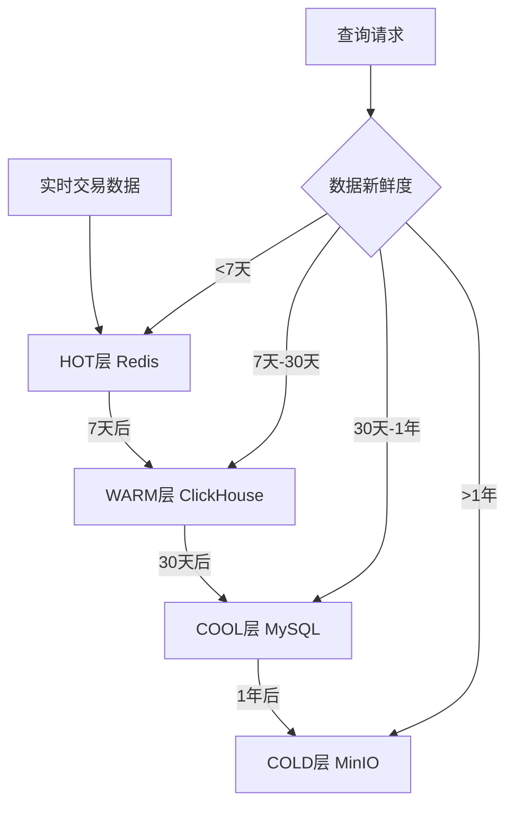
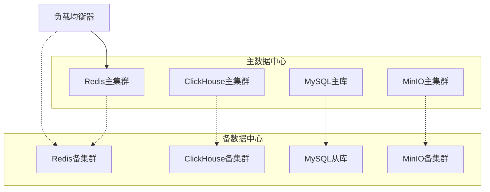

# 四层存储架构性能和容量规划方案

## 1. 架构概览

### 1.1 性能目标
- **HOT层 (Redis Cluster)**: 延迟 < 10ms, 支持10万QPS读取
- **WARM层 (ClickHouse)**: 延迟 < 100ms, 支持5000QPS查询  
- **COOL层 (MySQL)**: 延迟 < 500ms, 支持1000QPS读取
- **COLD层 (MinIO)**: 延迟 < 2s, 支持1GB/s吞吐量

### 1.2 数据分层策略


## 2. HOT层性能规划 (Redis Cluster)

### 2.1 硬件配置
```yaml
redis_cluster:
  nodes: 6  # 3主3从
  hardware:
    cpu: "8核 3.2GHz"
    memory: "32GB DDR4"
    storage: "500GB NVMe SSD"
    network: "10Gbps"
    
performance_targets:
  read_qps: 100000
  write_qps: 10000
  latency_p99: "<10ms"
  memory_usage: "<80%"
```

### 2.2 容量预测
```python
# 数据类型和存储预测
data_categories = {
    "实时行情数据": {
        "daily_volume": "100GB",
        "retention": "7天", 
        "total_size": "700GB"
    },
    "活跃交易数据": {
        "daily_volume": "50GB",
        "retention": "7天",
        "total_size": "350GB"
    },
    "技术指标缓存": {
        "daily_volume": "20GB", 
        "retention": "7天",
        "total_size": "140GB"
    }
}

# 总容量需求：约1.2TB (含副本)
# 实际配置：192GB (6节点 x 32GB)
# 压缩率：约6:1，满足需求
```

### 2.3 扩展策略
- **触发条件**: 内存使用率 > 80%
- **扩展方式**: 添加主从节点对
- **自动化**: Kubernetes HPA + Redis Sentinel
- **预警阈值**: 内存70%，QPS超过8万

## 3. WARM层性能规划 (ClickHouse)

### 3.1 集群配置
```yaml
clickhouse_cluster:
  shards: 3
  replicas: 2
  hardware:
    cpu: "16核 3.0GHz"
    memory: "64GB DDR4"
    storage: "1TB NVMe SSD"
    network: "10Gbps"
    
performance_targets:
  query_qps: 5000
  insert_qps: 500
  latency_p95: "<100ms"
  compression_ratio: "3:1"
```

### 3.2 存储容量规划
```sql
-- 数据增长预测模型
CREATE TABLE storage_forecast (
    data_type String,
    daily_size_gb Float64,
    retention_days Int32,
    monthly_growth_rate Float64,
    projected_size_tb Float64
) ENGINE = Memory;

INSERT INTO storage_forecast VALUES
('分钟级K线数据', 15.0, 30, 0.05, 0.5),
('小时级聚合数据', 1.5, 90, 0.03, 0.15),
('技术分析结果', 3.0, 60, 0.08, 0.2),
('交易信号数据', 2.0, 45, 0.06, 0.1);

-- 总存储需求：约1TB/月，压缩后约350GB
```

### 3.3 分区策略
```sql
-- 按时间分区提升查询性能
CREATE TABLE market_data (
    timestamp DateTime,
    symbol String,
    price Float64,
    volume Float64
) ENGINE = MergeTree()
PARTITION BY toYYYYMM(timestamp)
ORDER BY (symbol, timestamp)
SETTINGS index_granularity = 8192;
```

## 4. COOL层性能规划 (MySQL)

### 4.1 主从集群配置
```yaml
mysql_cluster:
  topology: "1主2从"
  hardware:
    cpu: "8核 2.8GHz"
    memory: "32GB DDR4"
    storage: "500GB SSD RAID10"
    network: "1Gbps"
    
performance_targets:
  read_qps: 1000
  write_qps: 200
  latency_p95: "<500ms"
  replication_lag: "<1s"
```

### 4.2 存储优化配置
```sql
-- 数据库存储优化
SET GLOBAL innodb_compression_level = 6;
SET GLOBAL innodb_page_compression = ON;
SET GLOBAL innodb_buffer_pool_size = '24GB';

-- 分表策略
CREATE TABLE trade_records_2025_01 (
    id BIGINT PRIMARY KEY,
    timestamp DATETIME,
    symbol VARCHAR(20),
    -- 其他字段...
    INDEX idx_symbol_time (symbol, timestamp)
) ENGINE=InnoDB 
  ROW_FORMAT=COMPRESSED 
  KEY_BLOCK_SIZE=8;
```

## 5. COLD层容量规划 (MinIO)

### 5.1 分布式存储配置
```yaml
minio_cluster:
  nodes: 4
  drives_per_node: 4
  hardware:
    cpu: "4核 2.4GHz"
    memory: "16GB DDR4"
    storage: "5TB 7.2K HDD"
    network: "1Gbps"
    
performance_targets:
  throughput: "1GB/s"
  concurrent_connections: 100
  availability: "99.9%"
  durability: "99.999999999%" # 11个9
```

### 5.2 存储策略
```yaml
# 纠删码配置
erasure_coding:
  data_drives: 8
  parity_drives: 4  
  storage_efficiency: "66.7%"
  
# 生命周期管理
lifecycle_policy:
  - name: "archive_old_data"
    filter:
      prefix: "historical/"
    transitions:
      - days: 30
        storage_class: "COLD"
      - days: 365
        storage_class: "DEEP_ARCHIVE"
```

## 6. 自动扩展策略

### 6.1 触发机制
```yaml
auto_scaling_rules:
  redis:
    scale_out_threshold:
      memory_usage: ">80%"
      qps: ">80000"
      latency_p99: ">8ms"
    scale_in_threshold:
      memory_usage: "<50%"
      qps: "<40000"
      
  clickhouse:
    scale_out_threshold:
      cpu_usage: ">70%"
      query_latency: ">80ms"
      disk_usage: ">80%"
    scale_in_threshold:
      cpu_usage: "<30%"
      query_latency: "<20ms"
      
  mysql:
    scale_out_threshold:
      connection_usage: ">80%"
      replication_lag: ">5s" 
      cpu_usage: ">75%"
      
  minio:
    scale_out_threshold:
      storage_usage: ">70%"
      bandwidth_usage: ">80%"
```

## 7. 成本优化策略

### 7.1 成本结构分析
```python
# 年度成本预算 (万元)
cost_breakdown = {
    "硬件成本": {
        "Redis集群": 25,
        "ClickHouse集群": 20, 
        "MySQL集群": 10,
        "MinIO集群": 8,
        "网络设备": 5
    },
    "软件许可": {
        "监控软件": 3,
        "备份软件": 2, 
        "安全软件": 2
    },
    "运维成本": {
        "人员": 15,
        "电费": 8,
        "机房": 6
    },
    "总成本": 104
}
```

### 7.2 成本优化措施
- **数据压缩**: 平均节省存储空间50%
- **智能分层**: 自动迁移降低热存储成本30% 
- **资源池化**: 提高资源利用率20%
- **预留实例**: 云服务费用节省15%
- **定期清理**: 自动删除过期数据节省存储10%

## 8. 灾难恢复规划

### 8.1 RTO/RPO目标
```yaml
disaster_recovery:
  rto: "4小时"  # Recovery Time Objective
  rpo: "15分钟"  # Recovery Point Objective
  
backup_strategy:
  full_backup: "每周"
  incremental_backup: "每小时"
  snapshot: "每15分钟"
  
recovery_procedures:
  hot_layer: "Redis Cluster主从切换 < 30秒"
  warm_layer: "ClickHouse副本恢复 < 1小时" 
  cool_layer: "MySQL主从切换 < 2小时"
  cold_layer: "MinIO数据恢复 < 4小时"
```

### 8.2 多活架构


## 9. 性能监控指标

### 9.1 关键性能指标 (KPI)
```yaml
performance_kpis:
  availability_sla: "99.95%"
  response_time_sla:
    hot_layer: "p95 < 5ms"
    warm_layer: "p95 < 50ms" 
    cool_layer: "p95 < 300ms"
    cold_layer: "p95 < 1s"
    
  throughput_targets:
    total_qps: "50000"
    write_qps: "5000"
    read_qps: "45000"
    
  data_consistency: "100%"
  backup_success_rate: "99.9%"
```

## 10. 实施验证计划

### 10.1 压力测试方案
```bash
#!/bin/bash
# 性能压力测试脚本

# Redis压力测试
redis-benchmark -h redis-cluster -p 6379 -n 100000 -c 50 -t set,get

# ClickHouse查询测试  
clickhouse-benchmark --host=clickhouse-cluster --queries=10000 --concurrency=50

# MySQL压力测试
sysbench mysql --mysql-host=mysql-master --table-size=1000000 run

# MinIO性能测试
mc admin speedtest minio-cluster --size=1GB --duration=60s
```

### 10.2 容量测试计划
```python
# 容量增长模拟测试
capacity_test_plan = {
    "阶段1": {
        "数据量": "100GB",
        "并发": "1000",
        "持续时间": "24小时"
    },
    "阶段2": {
        "数据量": "1TB", 
        "并发": "5000",
        "持续时间": "72小时"
    },
    "阶段3": {
        "数据量": "10TB",
        "并发": "10000", 
        "持续时间": "168小时"
    }
}
```

## 11. 总结与建议

### 11.1 关键成功因素
1. **分层清晰**: 严格按照数据访问模式分层
2. **监控完善**: 实时监控关键性能指标
3. **自动化**: 扩展、备份、故障恢复全自动化
4. **成本控制**: 持续优化成本效率
5. **容灾完备**: 多活架构保障业务连续性

### 11.2 风险提醒
- **容量规划过于保守**: 建议预留30%缓冲空间
- **网络带宽瓶颈**: 重点关注跨层数据传输性能
- **单点故障**: 确保每层都有冗余机制
- **成本失控**: 建立成本预警和控制机制

### 11.3 后续优化方向
- **AI驱动的自动调优**: 基于机器学习优化存储策略
- **边缘计算**: 就近部署减少网络延迟
- **新硬件采用**: 评估新一代存储技术收益
- **云原生改造**: 逐步迁移到Kubernetes平台

---

*本方案基于当前量化交易系统需求制定，随着业务发展需要定期评估调整。*