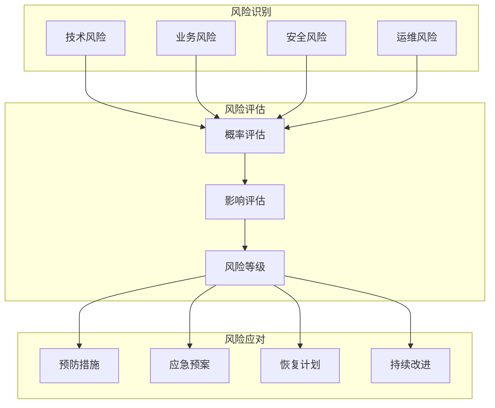
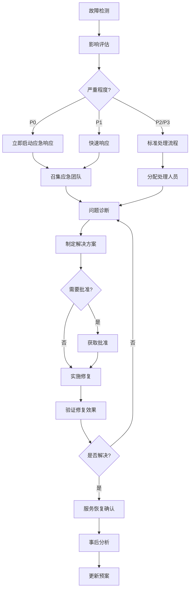
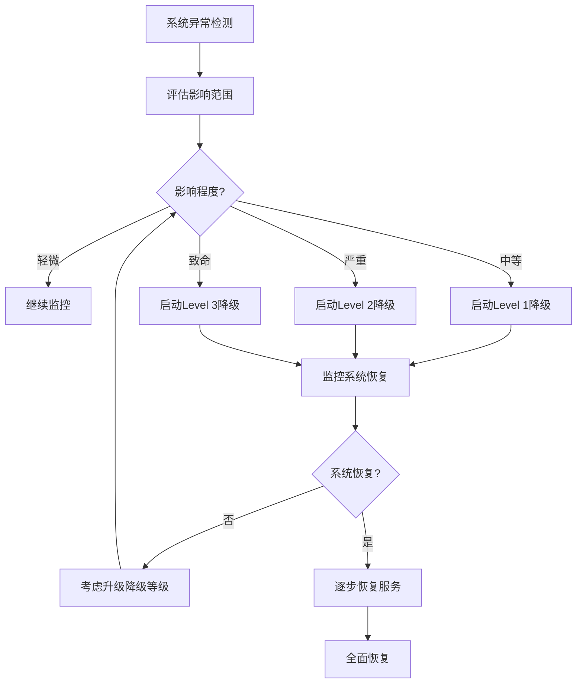

# 四层存储架构风险评估和应急预案

## 1. 风险评估概览

### 1.1 风险管理框架


### 1.2 风险评估矩阵
```yaml
risk_matrix:
  probability_levels:
    high: ">30% (每年3次以上)"
    medium: "10%-30% (每年1-3次)"
    low: "<10% (每年少于1次)"
    
  impact_levels:
    critical: "业务完全中断,数据丢失,法律风险"
    high: "严重性能下降,部分业务中断"
    medium: "轻微性能影响,功能受限"
    low: "用户体验下降,无功能影响"
    
  risk_priorities:
    P0: "严重影响 + 高/中概率"
    P1: "高影响 + 高/中概率,严重影响 + 低概率"
    P2: "中影响 + 高/中概率,高影响 + 低概率"
    P3: "低影响 + 任何概率,中影响 + 低概率"
```

## 2. 分层风险分析

### 2.1 HOT层 (Redis) 风险评估

#### 2.1.1 技术风险
```yaml
redis_technical_risks:
  memory_overflow:
    description: "内存使用超过限制导致服务不可用"
    probability: "medium"
    impact: "critical"
    priority: "P0"
    indicators:
      - "内存使用率 > 90%"
      - "OOM Killer 触发"
      - "连接被拒绝"
    
  cluster_split_brain:
    description: "集群脑裂导致数据不一致"
    probability: "low"
    impact: "critical"
    priority: "P1"
    indicators:
      - "多个主节点同时存在"
      - "客户端连接异常"
      - "Sentinel 状态异常"
      
  replication_lag:
    description: "主从同步延迟过大"
    probability: "medium"
    impact: "high"
    priority: "P1"
    indicators:
      - "从节点延迟 > 60秒"
      - "复制连接断开"
      - "数据不一致"
      
  performance_degradation:
    description: "命令执行延迟增加"
    probability: "high"
    impact: "medium"
    priority: "P2"
    indicators:
      - "P99延迟 > 10ms"
      - "慢查询日志增加"
      - "客户端超时"
```

#### 2.1.2 预防措施
```yaml
redis_prevention:
  capacity_management:
    - "设置内存使用警告阈值80%"
    - "实施内存淘汰策略"
    - "定期清理过期键"
    
  high_availability:
    - "配置Redis Sentinel"
    - "使用Redis Cluster"
    - "设置合理的故障转移超时"
    
  monitoring:
    - "实时监控内存使用率"
    - "监控主从同步状态"
    - "设置延迟告警"
    
  backup:
    - "定时RDB快照"
    - "AOF日志备份"
    - "跨数据中心备份"
```

### 2.2 WARM层 (ClickHouse) 风险评估

#### 2.2.1 技术风险
```yaml
clickhouse_technical_risks:
  disk_space_full:
    description: "磁盘空间不足导致写入失败"
    probability: "medium"
    impact: "high"
    priority: "P1"
    indicators:
      - "磁盘使用率 > 85%"
      - "写入操作失败"
      - "合并操作停止"
      
  query_performance:
    description: "查询性能严重下降"
    probability: "medium"
    impact: "high"
    priority: "P1"
    indicators:
      - "查询延迟 > 10秒"
      - "并发查询数过高"
      - "内存使用异常"
      
  replica_sync_failure:
    description: "副本同步失败"
    probability: "low"
    impact: "high"
    priority: "P1"
    indicators:
      - "副本延迟过大"
      - "ZooKeeper连接异常"
      - "数据不一致"
      
  data_corruption:
    description: "数据文件损坏"
    probability: "low"
    impact: "critical"
    priority: "P1"
    indicators:
      - "校验和错误"
      - "查询异常中止"
      - "部分数据丢失"
```

#### 2.2.2 预防措施
```yaml
clickhouse_prevention:
  storage_management:
    - "设置磁盘使用告警75%"
    - "配置TTL自动删除"
    - "定期数据压缩"
    
  performance_optimization:
    - "优化表结构设计"
    - "合理设置分区策略"
    - "监控查询性能"
    
  replication_monitoring:
    - "监控副本状态"
    - "检查ZooKeeper连接"
    - "验证数据一致性"
    
  data_integrity:
    - "定期数据校验"
    - "多层备份策略"
    - "故障检测机制"
```

### 2.3 COOL层 (MySQL) 风险评估

#### 2.3.1 技术风险
```yaml
mysql_technical_risks:
  master_failure:
    description: "主库故障导致写入不可用"
    probability: "low"
    impact: "critical"
    priority: "P1"
    indicators:
      - "主库连接失败"
      - "写入操作中断"
      - "从库切换触发"
      
  replication_broken:
    description: "主从复制中断"
    probability: "medium"
    impact: "high"
    priority: "P1"
    indicators:
      - "Slave_IO_Running: No"
      - "Slave_SQL_Running: No"
      - "复制延迟无限增大"
      
  slow_query_accumulation:
    description: "慢查询堆积影响性能"
    probability: "high"
    impact: "medium"
    priority: "P2"
    indicators:
      - "慢查询数量增加"
      - "连接数接近上限"
      - "锁等待时间长"
      
  binlog_corruption:
    description: "二进制日志损坏"
    probability: "low"
    impact: "high"
    priority: "P1"
    indicators:
      - "Binlog读取错误"
      - "复制中断"
      - "数据恢复困难"
```

#### 2.3.2 预防措施
```yaml
mysql_prevention:
  high_availability:
    - "配置主从复制"
    - "实现自动故障转移"
    - "定期故障切换演练"
    
  performance_monitoring:
    - "监控慢查询"
    - "优化查询语句"
    - "合理设置连接池"
    
  backup_strategy:
    - "定时全量备份"
    - "实时binlog备份"
    - "备份恢复测试"
    
  maintenance:
    - "定期表优化"
    - "索引维护"
    - "统计信息更新"
```

### 2.4 COLD层 (MinIO) 风险评估

#### 2.4.1 技术风险
```yaml
minio_technical_risks:
  node_permanent_failure:
    description: "节点永久故障超过容错能力"
    probability: "low"
    impact: "critical"
    priority: "P1"
    indicators:
      - "多个节点同时故障"
      - "纠删码无法恢复"
      - "数据丢失警告"
      
  storage_exhaustion:
    description: "存储空间耗尽"
    probability: "medium"
    impact: "high"
    priority: "P1"
    indicators:
      - "存储使用率 > 90%"
      - "写入操作失败"
      - "清理作业异常"
      
  network_partition:
    description: "网络分区导致集群分裂"
    probability: "low"
    impact: "high"
    priority: "P1"
    indicators:
      - "节点间通信失败"
      - "仲裁丢失"
      - "读写不一致"
      
  data_integrity_loss:
    description: "数据完整性受损"
    probability: "low"
    impact: "critical"
    priority: "P1"
    indicators:
      - "校验和错误"
      - "对象损坏"
      - "元数据不一致"
```

#### 2.4.2 预防措施
```yaml
minio_prevention:
  redundancy_design:
    - "配置适当纠删码比例"
    - "分布式部署"
    - "跨机架部署"
    
  capacity_management:
    - "监控存储使用率"
    - "设置使用告警"
    - "定期清理策略"
    
  network_reliability:
    - "冗余网络连接"
    - "网络监控"
    - "故障自动切换"
    
  data_validation:
    - "定期数据校验"
    - "完整性检查"
    - "修复作业监控"
```

## 3. 业务连续性风险

### 3.1 服务中断风险
```yaml
service_interruption_risks:
  complete_outage:
    description: "整个存储系统不可用"
    probability: "low"
    impact: "critical"
    priority: "P0"
    causes:
      - "数据中心级别故障"
      - "网络完全中断"
      - "电力系统故障"
      - "重大人为错误"
      
  partial_degradation:
    description: "部分功能不可用或性能下降"
    probability: "medium"
    impact: "high"
    priority: "P1"
    causes:
      - "单层存储故障"
      - "网络延迟增加"
      - "资源耗尽"
      - "配置错误"
      
  data_inconsistency:
    description: "数据一致性问题"
    probability: "medium"
    impact: "high"
    priority: "P1"
    causes:
      - "网络分区"
      - "同步失败"
      - "并发写入冲突"
      - "时钟偏差"
```

### 3.2 RTO/RPO 目标
```yaml
business_continuity_targets:
  hot_layer:
    rto: "30秒"
    rpo: "0秒"
    strategy: "自动故障转移"
    
  warm_layer:
    rto: "5分钟"
    rpo: "1分钟"
    strategy: "副本切换"
    
  cool_layer:
    rto: "10分钟"
    rpo: "5分钟"
    strategy: "主从切换"
    
  cold_layer:
    rto: "1小时"
    rpo: "15分钟"
    strategy: "数据恢复"
    
  overall_system:
    rto: "15分钟"
    rpo: "5分钟"
    strategy: "分层恢复"
```

## 4. 安全风险评估

### 4.1 数据安全风险
```yaml
data_security_risks:
  unauthorized_access:
    description: "未授权访问敏感数据"
    probability: "low"
    impact: "critical"
    priority: "P1"
    mitigation:
      - "强身份认证"
      - "访问控制列表"
      - "审计日志"
      
  data_leakage:
    description: "数据泄露"
    probability: "low"
    impact: "critical"
    priority: "P1"
    mitigation:
      - "数据加密"
      - "网络隔离"
      - "DLP系统"
      
  insider_threat:
    description: "内部人员威胁"
    probability: "low"
    impact: "high"
    priority: "P1"
    mitigation:
      - "最小权限原则"
      - "操作审计"
      - "双人操作"
      
  malicious_attack:
    description: "恶意攻击"
    probability: "medium"
    impact: "high"
    priority: "P1"
    mitigation:
      - "防火墙保护"
      - "入侵检测"
      - "安全补丁管理"
```

### 4.2 合规风险
```yaml
compliance_risks:
  data_protection:
    description: "违反数据保护法规"
    probability: "low"
    impact: "critical"
    priority: "P1"
    requirements:
      - "GDPR合规"
      - "数据本地化"
      - "用户权利保护"
      
  audit_failure:
    description: "审计不通过"
    probability: "medium"
    impact: "high"
    priority: "P1"
    requirements:
      - "审计日志完整"
      - "访问记录详细"
      - "变更追踪"
      
  regulatory_change:
    description: "法规变化影响"
    probability: "medium"
    impact: "medium"
    priority: "P2"
    requirements:
      - "持续监控法规变化"
      - "快速适应能力"
      - "合规评估"
```

## 5. 应急响应组织架构

### 5.1 应急响应团队
```yaml
emergency_response_team:
  incident_commander:
    role: "事故总指挥"
    responsibilities:
      - "统一指挥协调"
      - "重大决策制定"
      - "资源调配"
      - "对外沟通"
    personnel: "技术总监/运维总监"
    
  technical_lead:
    role: "技术负责人"
    responsibilities:
      - "技术方案制定"
      - "问题诊断分析"
      - "修复操作执行"
      - "技术风险评估"
    personnel: "高级工程师/架构师"
    
  communication_coordinator:
    role: "沟通协调员"
    responsibilities:
      - "内外部沟通"
      - "状态信息更新"
      - "文档记录"
      - "媒体应对"
    personnel: "项目经理/产品经理"
    
  business_representative:
    role: "业务代表"
    responsibilities:
      - "业务影响评估"
      - "优先级判断"
      - "用户沟通"
      - "业务决策支持"
    personnel: "业务负责人"
    
  support_specialists:
    role: "专业支持"
    responsibilities:
      - "专项技术支持"
      - "第三方协调"
      - "后勤保障"
    personnel: "DBA/网络工程师/安全专家"
```

### 5.2 值班制度
```yaml
on_call_schedule:
  coverage: "7x24小时"
  rotation: "每周轮换"
  escalation_levels:
    L1_primary:
      response_time: "5分钟内响应"
      escalation_timeout: "15分钟"
      personnel: "值班工程师"
      
    L2_senior:
      response_time: "15分钟内响应"
      escalation_timeout: "30分钟"
      personnel: "高级工程师"
      
    L3_expert:
      response_time: "30分钟内响应"
      escalation_timeout: "1小时"
      personnel: "技术专家/架构师"
      
    L4_management:
      response_time: "1小时内响应"
      personnel: "技术管理层"
```

## 6. 应急响应流程

### 6.1 事故响应流程


### 6.2 具体应急操作

#### 6.2.1 Redis集群故障处理
```yaml
redis_emergency_procedures:
  memory_overflow:
    immediate_actions:
      - "检查内存使用情况"
      - "清理过期键"
      - "增加内存限制"
      - "重启问题节点"
    commands:
      - "redis-cli info memory"
      - "redis-cli flushdb"
      - "systemctl restart redis"
      
  cluster_split_brain:
    immediate_actions:
      - "确定正确的主节点"
      - "停止错误的主节点"
      - "重新配置Sentinel"
      - "验证数据一致性"
    commands:
      - "redis-cli cluster nodes"
      - "redis-cli sentinel masters"
      - "redis-cli cluster reset"
      
  replication_failure:
    immediate_actions:
      - "检查网络连接"
      - "重启复制进程"
      - "重建从节点"
      - "验证数据同步"
    commands:
      - "redis-cli info replication"
      - "redis-cli slaveof no one"
      - "redis-cli slaveof <master-ip> <port>"
```

#### 6.2.2 ClickHouse集群故障处理
```yaml
clickhouse_emergency_procedures:
  disk_space_full:
    immediate_actions:
      - "清理临时文件"
      - "删除过期数据"
      - "扩展磁盘容量"
      - "重启服务"
    commands:
      - "du -sh /var/lib/clickhouse/*"
      - "clickhouse-client -q 'OPTIMIZE TABLE table_name'"
      - "systemctl restart clickhouse-server"
      
  query_performance_issue:
    immediate_actions:
      - "杀死长时间运行查询"
      - "增加资源限制"
      - "重启服务"
      - "分析查询计划"
    commands:
      - "clickhouse-client -q 'SHOW PROCESSLIST'"
      - "clickhouse-client -q 'KILL QUERY WHERE query_id = ?'"
      
  replica_sync_failure:
    immediate_actions:
      - "检查ZooKeeper状态"
      - "重启副本同步"
      - "重建副本"
      - "验证数据一致性"
    commands:
      - "clickhouse-client -q 'SYSTEM SYNC REPLICA table_name'"
      - "clickhouse-client -q 'SYSTEM RESTART REPLICA table_name'"
```

#### 6.2.3 MySQL主从故障处理
```yaml
mysql_emergency_procedures:
  master_failure:
    immediate_actions:
      - "确认主库状态"
      - "选择新主库"
      - "执行主从切换"
      - "更新应用配置"
    commands:
      - "systemctl status mysql"
      - "mysql -e 'SHOW MASTER STATUS'"
      - "mysql -e 'STOP SLAVE; RESET SLAVE'"
      - "mysql -e 'CHANGE MASTER TO ...'"
      
  replication_broken:
    immediate_actions:
      - "检查复制状态"
      - "跳过错误事务"
      - "重建复制关系"
      - "数据一致性检查"
    commands:
      - "mysql -e 'SHOW SLAVE STATUS\\G'"
      - "mysql -e 'SET GLOBAL sql_slave_skip_counter=1'"
      - "mysql -e 'START SLAVE'"
      
  performance_degradation:
    immediate_actions:
      - "查看慢查询"
      - "杀死异常进程"
      - "优化表结构"
      - "重启服务"
    commands:
      - "mysql -e 'SHOW PROCESSLIST'"
      - "mysql -e 'KILL <process_id>'"
      - "mysql -e 'OPTIMIZE TABLE table_name'"
```

#### 6.2.4 MinIO集群故障处理
```yaml
minio_emergency_procedures:
  node_failure:
    immediate_actions:
      - "检查节点状态"
      - "启动修复作业"
      - "替换故障硬盘"
      - "重新加入集群"
    commands:
      - "mc admin info minio-cluster"
      - "mc admin heal minio-cluster"
      - "systemctl restart minio"
      
  storage_full:
    immediate_actions:
      - "清理过期对象"
      - "执行生命周期策略"
      - "扩展存储容量"
      - "重新平衡数据"
    commands:
      - "mc rm --recursive --force minio-cluster/bucket/old-data/"
      - "mc ilm add minio-cluster/bucket --expiry-days 30"
      - "mc admin rebalance start minio-cluster"
      
  data_corruption:
    immediate_actions:
      - "隔离故障节点"
      - "从备份恢复"
      - "验证数据完整性"
      - "重建纠删码"
    commands:
      - "mc admin service stop minio-cluster"
      - "mc mirror backup-location/ minio-cluster/bucket/"
      - "mc admin heal -r minio-cluster"
```

## 7. 通信和升级机制

### 7.1 通信流程
```yaml
communication_procedures:
  internal_communication:
    incident_declaration:
      - "发送事故通知邮件"
      - "创建应急沟通群"
      - "启动电话会议"
      
    status_updates:
      frequency: "每15分钟"
      channels:
        - "应急沟通群"
        - "管理层邮件"
        - "状态页面更新"
      
    resolution_notification:
      - "服务恢复确认"
      - "影响范围总结"
      - "后续行动计划"
      
  external_communication:
    customer_notification:
      channels:
        - "官方公告"
        - "客户邮件"
        - "社交媒体"
      timing:
        - "P0事故: 30分钟内"
        - "P1事故: 2小时内"
        
    stakeholder_updates:
      - "业务部门通知"
      - "合作伙伴沟通"
      - "监管机构报告"
      
    media_response:
      spokesperson: "指定发言人"
      key_messages: "事前准备"
      crisis_communication: "专业团队"
```

### 7.2 升级机制
```yaml
escalation_matrix:
  time_based_escalation:
    - level: "L1"
      timeout: "15分钟"
      action: "升级到L2"
      
    - level: "L2"
      timeout: "30分钟"
      action: "升级到L3"
      
    - level: "L3"
      timeout: "1小时"
      action: "升级到管理层"
      
  severity_based_escalation:
    P0_critical:
      immediate: "通知所有级别"
      escalation: "每15分钟升级"
      
    P1_high:
      immediate: "通知L1-L3"
      escalation: "每30分钟升级"
      
    P2_medium:
      immediate: "通知L1-L2"
      escalation: "每2小时升级"
```

## 8. 灾难恢复计划

### 8.1 灾难场景分类
```yaml
disaster_scenarios:
  data_center_failure:
    description: "主数据中心完全不可用"
    probability: "low"
    impact: "critical"
    rto: "4小时"
    rpo: "15分钟"
    strategy: "切换到备用数据中心"
    
  regional_disaster:
    description: "地区性灾难影响多个数据中心"
    probability: "very_low"
    impact: "critical"
    rto: "24小时"
    rpo: "1小时"
    strategy: "跨地区灾难恢复"
    
  cyber_attack:
    description: "大规模网络攻击"
    probability: "low"
    impact: "critical"
    rto: "8小时"
    rpo: "30分钟"
    strategy: "隔离系统,从备份恢复"
    
  data_corruption:
    description: "大规模数据损坏"
    probability: "very_low"
    impact: "critical"
    rto: "12小时"
    rpo: "4小时"
    strategy: "从历史备份恢复"
```

### 8.2 恢复策略

#### 8.2.1 多活架构部署
```yaml
multi_active_architecture:
  primary_dc:
    location: "北京数据中心"
    capacity: "100%业务负载"
    components:
      - "Redis主集群"
      - "ClickHouse主集群"
      - "MySQL主库"
      - "MinIO主集群"
      
  secondary_dc:
    location: "上海数据中心"
    capacity: "100%业务负载"
    components:
      - "Redis备集群"
      - "ClickHouse备集群"
      - "MySQL从库"
      - "MinIO备集群"
      
  failover_mechanism:
    automatic:
      - "Redis Sentinel自动切换"
      - "负载均衡器健康检查"
      
    semi_automatic:
      - "ClickHouse手动切换"
      - "MySQL主从切换"
      
    manual:
      - "MinIO数据恢复"
      - "应用配置更新"
```

#### 8.2.2 备份和恢复策略
```yaml
backup_recovery_strategy:
  backup_types:
    real_time:
      frequency: "连续"
      method: "主从同步"
      rpo: "0-5分钟"
      
    incremental:
      frequency: "每小时"
      method: "增量备份"
      rpo: "1小时"
      
    full:
      frequency: "每天"
      method: "完整备份"
      rpo: "24小时"
      
    archive:
      frequency: "每周"
      method: "归档备份"
      retention: "1年"
      
  recovery_procedures:
    point_in_time:
      - "确定恢复目标时间"
      - "选择合适备份"
      - "执行恢复操作"
      - "验证数据完整性"
      
    selective_recovery:
      - "识别受影响数据"
      - "从备份中提取"
      - "合并到生产系统"
      - "验证业务功能"
```

## 9. 业务降级策略

### 9.1 服务降级矩阵
```yaml
service_degradation_matrix:
  level_1_minimal:
    description: "保留核心功能"
    availability: "90-95%"
    actions:
      - "禁用非核心功能"
      - "降低数据精度"
      - "延长缓存时间"
      
  level_2_reduced:
    description: "基本功能可用"
    availability: "70-90%"
    actions:
      - "只读模式"
      - "批量处理"
      - "异步处理"
      
  level_3_emergency:
    description: "紧急模式"
    availability: "50-70%"
    actions:
      - "静态页面"
      - "离线处理"
      - "手动操作"
      
  level_4_maintenance:
    description: "维护模式"
    availability: "<50%"
    actions:
      - "服务暂停"
      - "维护页面"
      - "紧急通知"
```

### 9.2 降级决策流程


## 10. 风险预防和持续改进

### 10.1 定期评估计划
```yaml
risk_assessment_schedule:
  quarterly_review:
    scope: "全面风险评估"
    activities:
      - "更新风险清单"
      - "重新评估风险等级"
      - "审查预防措施"
      - "更新应急预案"
      
  monthly_inspection:
    scope: "关键系统检查"
    activities:
      - "基础设施巡检"
      - "备份验证"
      - "监控系统检查"
      - "文档更新"
      
  weekly_drill:
    scope: "应急演练"
    activities:
      - "故障模拟"
      - "响应时间测试"
      - "流程验证"
      - "团队培训"
```

### 10.2 持续改进机制
```yaml
continuous_improvement:
  post_incident_review:
    timeline: "事故后48小时内"
    participants:
      - "应急响应团队"
      - "业务影响方"
      - "技术专家"
    deliverables:
      - "根因分析报告"
      - "改进行动计划"
      - "预案更新建议"
      
  lessons_learned:
    knowledge_base:
      - "故障案例库"
      - "解决方案库" 
      - "最佳实践"
    sharing_mechanism:
      - "月度技术分享"
      - "年度总结报告"
      - "培训材料更新"
      
  metrics_tracking:
    kpis:
      - "MTTD (故障检测时间)"
      - "MTTR (故障恢复时间)"
      - "风险评估准确性"
      - "预案执行成功率"
    reporting:
      - "月度风险报告"
      - "季度改进总结"
      - "年度风险评估"
```

### 10.3 培训和能力建设
```yaml
training_program:
  new_hire_training:
    duration: "2周"
    content:
      - "风险管理基础"
      - "应急响应流程"
      - "系统架构理解"
      - "工具使用培训"
      
  ongoing_training:
    frequency: "每季度"
    content:
      - "新技术风险"
      - "案例分析"
      - "技能提升"
      - "跨团队协作"
      
  certification_requirements:
    - "应急响应认证"
    - "系统管理认证"  
    - "安全管理认证"
    - "业务连续性认证"
    
  simulation_exercises:
    frequency: "每月"
    scenarios:
      - "系统故障演练"
      - "数据中心故障"
      - "网络攻击响应"
      - "数据恢复演练"
```

## 11. 合规和法律考虑

### 11.1 法规遵从
```yaml
regulatory_compliance:
  data_protection:
    regulations:
      - "网络安全法"
      - "数据安全法"
      - "个人信息保护法"
    requirements:
      - "数据分类分级"
      - "访问权限管理"
      - "数据处理记录"
      - "安全事件报告"
      
  financial_regulations:
    regulations:
      - "银行业监督管理办法"
      - "证券投资基金法"
    requirements:
      - "数据备份要求"
      - "系统可用性标准"
      - "审计日志保存"
      - "风险管理制度"
      
  industry_standards:
    standards:
      - "ISO 27001"
      - "ISO 22301"
      - "COBIT"
    implementation:
      - "管理体系建立"
      - "风险评估框架"
      - "持续监控机制"
      - "定期审核评估"
```

### 11.2 责任和保险
```yaml
liability_insurance:
  cyber_insurance:
    coverage:
      - "数据泄露损失"
      - "业务中断损失"
      - "第三方责任"
      - "法律费用"
    amount: "1000万人民币"
    
  professional_liability:
    coverage:
      - "技术错误"
      - "疏忽责任"
      - "合同违约"
    amount: "500万人民币"
    
  business_interruption:
    coverage:
      - "收入损失"
      - "额外费用"
      - "客户赔偿"
    amount: "2000万人民币"
```

## 12. 总结和建议

### 12.1 关键成功因素
1. **全面风险识别**: 系统性分析各层风险
2. **分级响应机制**: 根据影响程度采取相应措施
3. **自动化程度**: 减少人工干预提高响应速度
4. **团队能力**: 专业团队和持续培训
5. **持续改进**: 基于实践经验不断优化

### 12.2 实施建议
- **分阶段实施**: 先实施高优先级风险的预防措施
- **定期演练**: 通过模拟测试验证预案有效性
- **文档维护**: 保持风险评估和预案的及时更新
- **工具支撑**: 利用自动化工具提高响应效率
- **文化建设**: 建立风险意识和应急响应文化

### 12.3 持续优化方向
- **智能风险预测**: 利用AI/ML技术进行风险预测
- **自动化响应**: 更多场景的自动化故障处理
- **跨云灾备**: 混合云和多云环境的灾难恢复
- **实时决策**: 基于实时数据的动态风险调整

---

*本风险评估和应急预案为四层存储架构提供全面的风险防控和应急响应能力，确保业务连续性和数据安全。*